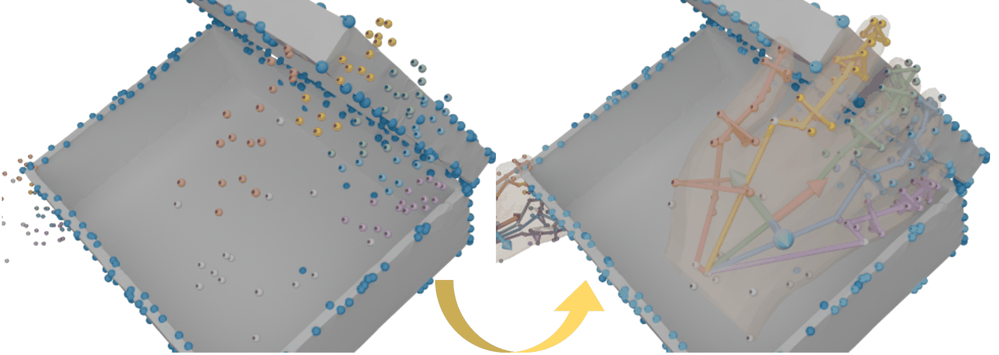
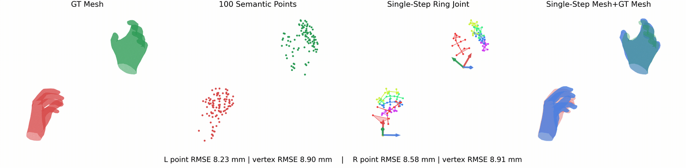

# semantic_mano_ik



`semantic_mano_ik` is a compact MANO repository built around a fixed set of 100 semantic hand points. It provides single-step IK, direct MANO fitting, refinement from IK initialization, forward point export from MANO, method comparison, sequence visualization, and asset-building utilities.

## Installation

```bash
pip install -r requirements.txt
```

Set the MANO model path before running the scripts:

```bash
export MANO_PATH=/path/to/mano
```

MANO model files are not included in this repository because of the MANO license. Download them from the official website: https://mano.is.tue.mpg.de/ and set `MANO_PATH` to the extracted model directory.


## Quick Start

- `single_ik`: estimate MANO from 100 semantic points. 
```bash
python -u methods/single_ik/run_single_ik.py --points-path samples/ring_joint_demo.npy --hand-side right --mano-path /path/to/mano --output-dir outputs/single_ik
```
- `refine_ik`: start from `single_ik` and continue iterative optimization. 
```bash
python -u methods/refine_ik/refine_from_points.py --input-path samples/ring_joint_demo.npy --mano-path /path/to/mano --output-dir outputs/refine_ik --export-glb
```
- `mano_fitting`: directly optimize MANO parameters from the same 100-point input. 
```bash
python -u methods/mano_fitting/fit_from_points.py --input-path samples/ring_joint_demo.npy --mano-path /path/to/mano --output-dir outputs/mano_fitting --export-glb
```
- `single_ik` visualization: inspect the semantic rings, joint centers, and reconstructed hand. 
```bash
python -u methods/single_ik/visualize.py ring-joint --sample-path samples/ring_joint_demo.npy --mano-path /path/to/mano
```
`assets/sequence_mano.npz` is a MANO motion asset, and `assets/sequence_visualization.gif` is its inline preview rendered from that sequence.



- method comparison: compare `single_ik`, `mano_fitting`, and `refine_ik` on the same payload. 
```bash
python -u scripts/compare_methods.py --input-path samples/ring_joint_demo.npy --mano-path /path/to/mano --output-dir outputs/compare_methods --export-glb
```

## Available Tools

- `methods/single_ik/visualize.py` also provides `wrist-frame`, `anchor-groups`, and `axis-prior`.
- `methods/single_ik/evaluate_reconstruction.py` runs synthetic reconstruction evaluation for the single-step estimator.
- `scripts/export_points_from_mano.py` exports mesh, joints, semantic points, and a GLB visualization from MANO parameters.
- `scripts/visualize_sample_sequence.py` visualizes MANO motion sequences and runs per-frame IK.
- `scripts/build_assets.py` rebuilds the semantic-point index and roll-axis prior.
- `scripts/build_demo_sample.py` rebuilds the local demo sample used across the repository.

## Assets

- `assets/part_ik_hand_index_100.npy`: fixed 100-point semantic index order
- `assets/mano_flat_hand_axis_prior.npy`: roll-axis prior used by `single_ik`
- `assets/mano_flat_hand_anchor_groups.glb`: flat-hand anchor-group visualization
- `samples/ring_joint_demo.npy`: local demo sample with points, GT MANO, and `single_ik` output
